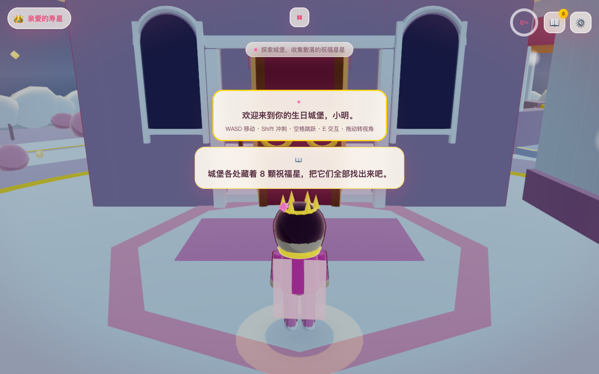

# 生日快乐 · 云端粉色城堡

**🎂 在线试玩 → https://mahua020202-dotcom.github.io/birthday-messenger/**

一座漂浮在云海中的粉色生日城堡。寿星亲自走进去，收集祝福、许下愿望、打开惊喜、启动庆典，
最后把整个生日世界点亮。

手机扫一下就能玩，链接后面直接带参数就是专属版本：

```
https://mahua020202-dotcom.github.io/birthday-messenger/?name=寿星名字&wishes=愿你天天开心@妈妈|愿你梦想成真&surprise=贺卡留言
```

纯前端实现：**Three.js + 原生 ES Modules + GLSL**，没有后端、没有构建步骤、没有一张外部贴图、
没有一段外部音乐。所有几何体、着色器、粒子、音效全部程序化生成。



---

## 快速开始

浏览器的安全策略不允许 `file://` 直接加载 ES Modules，所以需要起一个静态服务器（不需要后端逻辑）：

```bash
cd birthday-castle
python3 -m http.server 5180
# 然后打开 http://localhost:5180/index.html
```

或者用 package.json 里预置的脚本：

```bash
npm start          # 等价于 python3 -m http.server 5180
```

> 想把它分享给寿星？把整个 `birthday-castle/` 目录丢到任意静态托管（Vercel / Netlify / GitHub Pages /
> 对象存储）即可，无需任何服务器配置。

## 定制链接

一切内容都可以通过 URL 参数注入，做一张专属邀请函：

```
http://localhost:5180/index.html?name=小明&wishes=愿你天天开心@妈妈|愿你梦想成真@好友&surprise=愿你永远是那个会为自己鼓掌的人&theme=pink
```

| 参数 | 说明 |
| --- | --- |
| `name` | 寿星名字。会出现在开场、HUD、贺卡、天空粒子文字里 |
| `wishes` | 祝福语，用 `\|` 分隔。每条可用 `内容@署名` 指定署名。不足 6 条会用内置祝福补齐，最多 8 条 |
| `surprise` | 惊喜贺卡上的留言 |
| `theme` | 主题色：`pink`（默认）/ `purple` / `gold` |

不带任何参数也能直接玩，会用内置的 8 条祝福和「亲爱的寿星」作为称呼。

## 玩法

| 操作 | 桌面 | 移动端 |
| --- | --- | --- |
| 移动 | `WASD` / 方向键 | 左下虚拟摇杆 |
| 冲刺 | `Shift`（4 → 7 m/s） | 摇杆推到外圈 |
| 跳跃 | `空格` | 右下「跳跃」 |
| 交互 | `E` / 点击物体 | 右下「交互」/ 点物体 |
| 旋转视角 | 鼠标拖拽 | 单指拖拽 |
| 缩放 | 滚轮 | 双指捏合 |
| 面板 | `1` 祝福册 `2` 许愿 `3` 礼物 `4` 庆典 `5` 设置 `Esc` 暂停 | 右上角按钮 |

**一段完整的旅程（约 5–10 分钟）**

1. 云海之上，粉色城堡在等你 —— 点「进入城堡」，镜头沿曲线飞向大门。
2. 大门打开，寿星出现在门口，镜头从门内缓缓退到身后，切为第三人称。
3. 城堡各处藏着 **8 颗祝福星**，靠近后按 `E` 收集，祝福语会浮现在屏幕中央并进入祝福册。
4. 东侧凉亭的**许愿池**：写下愿望，一颗流星从池心飞向夜空，天上多一颗属于你的星。
5. 东北角礼物房里的**金色惊喜礼盒**：开盖弹出蛋糕与彩带，展开一张专属贺卡。
6. 南侧**蛋糕塔**：靠近吹灭蜡烛，会有一小簇烟花。
7. 收满 3 颗祝福并许过愿后，大厅中央的**庆典按钮**亮起 —— 烟花、彩带、气球、音乐切欢快版、镜头环绕城堡。
8. 沿着广场右侧的大台阶登上**顶层露台**。
9. 进度到 100，整个生日世界点亮：天空用粒子写出「生日快乐，[名字]」。

进度权重：祝福星 8×5 = 40，许愿 15，惊喜 20，庆典 15，露台 10，合计 100。

## 项目结构

```
index.html                  入口：UI 结构 + import map（指向本地 vendor）
package.json                npm start = 起静态服务器
src/
  main.js                   总导演：参数解析 → 装配 → 主循环
  SceneManager.js           渲染器 / 场景 / 相机 / 更新注册表 / 画质档位
  PostProcessing.js         Bloom → 颜色分级 → 暗角 → FXAA → OutputPass
  ToonMaterial.js           赛璐璐材质工厂 + 反向描边外壳 + 程序化贴图
  DataLoader.js             URL 参数、内置祝福、主题色、中英文案
  StateManager.js           全局状态 / 存档 / 进度事件
  UIManager.js              全部 DOM 操作（HUD、祝福册、许愿框、贺卡、设置、结算）
  InputManager.js           键鼠 + 触摸 + 虚拟摇杆，统一接口与边缘触发
  InteractionManager.js     可交互物注册表、就近目标、高亮、点击拾取
  CameraController.js       第三人称跟随 / 开场飞入 / 庆典环绕
  CloudSea.js               3–5 层 FBM 云海 + 漂浮光点
  Sky.js                    天空穹顶 + 逐颗点亮的星空 + 许愿星 + 粒子文字
  Island.js                 漂浮岛、大理石小径、云朵护栏、卫星岛
  Castle.js                 大厅 / 塔楼 / 露台与大台阶 / 四大互动区 / 装饰
  Character.js              低模寿星 + 第三人称角色控制器
  ParticleSystem.js         定长缓冲池粒子（爆裂 / 喷发 / 流星 / 烟花）
  AudioManager.js           全合成音频：5 个声部的实时配乐 + 13 种音效
  BlessingSystem.js         祝福星收集
  WishSystem.js             许愿池与流星
  SurpriseSystem.js         惊喜礼盒、贺卡、蛋糕与蜡烛
  CelebrationSystem.js      庆典按钮、烟花、彩带、气球、环绕镜头
  ProgressSystem.js         把 progress 翻译成整个世界的变化 + 最终点亮
  shaders/
    toon.js                 赛璐璐 + 描边（支持 InstancedMesh，含大气雾）
    cloud.js                FBM 云海
    water.js                许愿池水面涟漪
    sky.js                  天空渐变 / 极光 / 星点
    firework.js             通用粒子
    post.js                 颜色分级 / 暗角
  utils/
    math.js  easing.js  merge.js
vendor/three/               本地化的 Three.js r170（build + postprocessing + shaders + utils）
preview/                    截图
```

约 9.6k 行 JS + 0.6k 行 HTML/CSS。

## 实现要点

**赛璐璐着色（`shaders/toon.js`）**
`NdotL` 离散化为 3–4 级后再与半兰伯特混合，暗部不会死黑；叠加边缘光、自下而上的补光、
自发光与大气雾。所有 Toon 材质共享同一批环境 uniform（环境光/方向光/雾），
所以「点亮进度」只需改一次即可作用于整个场景。

**描边（反向外壳法）**
每个主要网格挂一个反面副本沿法线外扩，宽度按视距缩放，屏幕上近似恒定粗细。
描边材质按参数缓存复用，而不是逐物体新建。

**本地化的 Three.js**
`vendor/three/` 里放了完整的 r170 模块与 addons，`index.html` 用 import map 映射裸导入。
运行时不请求任何 CDN，断网也能玩。

**进度驱动一切**
`ProgressSystem` 把 0–100 的进度翻译成：环境色温、云海配色、天空渐变、星星亮度、
窗户点亮数量、泛光强度、音乐声部层次。所有过渡都走阻尼插值，没有突变。

**性能**
- 静态几何体合并：城堡里 289 个「建好就不动」的零件按材质烘焙成 15 个网格 + 2 个描边网格。
- 重复物体（灌木、花、草叶、护栏云、彩带、气球、星星挂饰、奶油花边）全部 InstancedMesh。
- 粒子用单个定长缓冲池的 Points，CPU 更新位置、GPU 负责发光与淡出。
- 三档画质：分辨率 / 抗锯齿 / Bloom / FXAA / 云层数 / 粒子上限 / 星数。
- 页面不可见时暂停渲染循环；`dt` 上限 0.1s，防止切后台回来穿模。

实测（1280×800）：起始 **276 draw call / 12 万三角面**，庆典高潮 **338 / 14 万**。
（Headless 测试跑在 SwiftShader 软件渲染上，帧率数据不具参考性，故未收录。）

**音频（`AudioManager.js`）**
Web Audio API 现场合成。背景音乐是 5 个声部（铺底 pad / 铃铛 / 低音 / 鼓组 / 主旋律）的
16 分音符音序器，演奏 C–Am–F–G 进行；声部按进度逐层进入，庆典时切到欢快版并演奏
《生日快乐歌》旋律（该旋律自 2016 年起已属公有领域）。所有音效（脚步、跳跃、铃铛、
流星、礼花、人群欢呼、吹蜡烛、开门）也都是振荡器 + 噪声 + 滤波器现场捏出来的。
首次用户交互后才启动，符合浏览器自动播放策略。

## 与规格的差异（如实说明）

1. **不使用实时阴影贴图**。自定义 Toon Shader 不接受 Three.js 的阴影贴图，
   改用「接触阴影贴片 + 定向光离散色阶」来表现明暗关系，移动端更稳。
2. **点光源用「自发光材质 + 加色光晕贴片」实现**，而不是 `THREE.PointLight`——
   原因同上，自定义着色器不参与 Three.js 的光照管线。
3. **着色器写成了 `.js` 导出字符串**（`src/shaders/*.js`）而不是 `.vert` / `.frag` 文件，
   因为纯浏览器环境没有构建步骤，无法 `import` 原始 GLSL 文本。
4. **环境光强度保留规格里的 0.3 → 0.8 语义**，但在着色器内乘了一个统一的
   `uLightGain = 0.62` 能量系数——不这样做满进度时会整体过曝成白屏。
5. **移动端画质默认为「中」**（需在设置里手动切「高」），而不是规格里的全开。
6. 画质切换的分辨率/泛光/FXAA 立即生效，云层数与粒子上限需要重新进入才重建。

## 已验证项

用 Playwright + 真实 Chromium 跑过完整回归（`qa/bday-test.cjs`、`qa/bday-mobile.cjs`），
22 张关键节点截图，结论：

- ✅ 加载与全流程 **零控制台错误 / 零页面异常 / 零资源加载失败**
- ✅ 云海流动、进度驱动的配色过渡
- ✅ 城堡结构完整，窗户随进度逐个点亮
- ✅ 角色移动（4 m/s）、冲刺（7 m/s）、跳跃、走台阶、岛屿边缘保护
- ✅ 相机跟随平滑，鼠标拖拽旋转 + 滚轮缩放生效，避墙避地
- ✅ 8 颗祝福星可收集，祝福语弹出并进入祝福册（含未收集的「？？？」）
- ✅ 许愿池交互 → 弹窗 → 愿望写入 localStorage → 流星飞向夜空并生成新星
- ✅ 惊喜礼盒开盖、贺卡展开、蛋糕弹出、蜡烛可吹灭
- ✅ 庆典按钮满足条件后解锁 → 烟花 / 彩带 / 气球 / 环绕镜头 / 天空字样
- ✅ 顶层露台触发 +10，进度 100 触发最终点亮与结算面板
- ✅ 移动端（390×844 @2x）：摇杆移动、跳跃按钮、交互按钮、竖屏视场角自适应
- ✅ 刷新后弹出「继续上次的生日旅程」并正确恢复进度

## 无障碍

- 全部交互都可用键盘完成（含 `1`–`5` 快捷键与 `Esc`）。
- 设置里有「减少动态效果」：降低相机阻尼、削弱极光与粒子发射量、关闭泛光。
- 音效可单独关闭；重要信息一律以文字 Toast 呈现。
- 中英双语，所有 UI 文案集中在 `DataLoader.js` 的 `I18N` 里。

## 许可

代码可自由修改复用。Three.js 为 MIT 协议，已本地化在 `vendor/`。
除此之外不含任何受版权保护的模型、贴图、音乐或代码。
